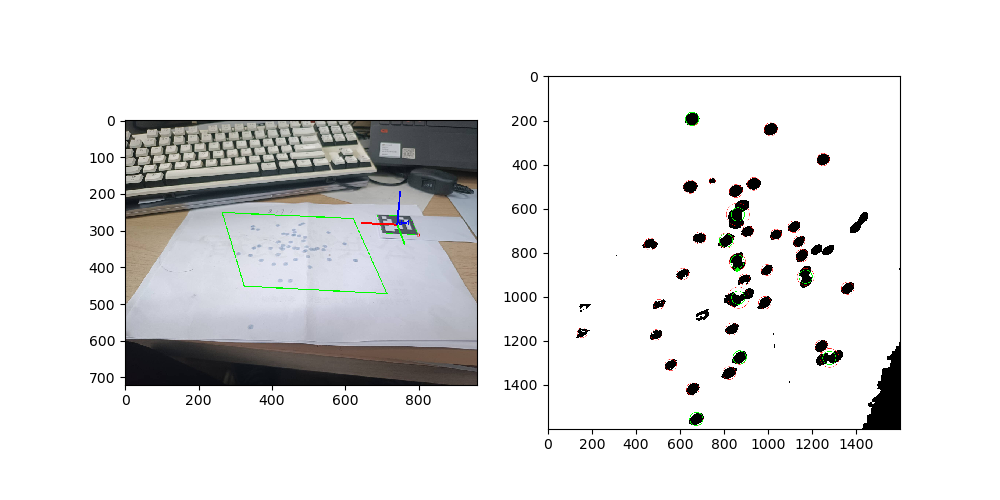
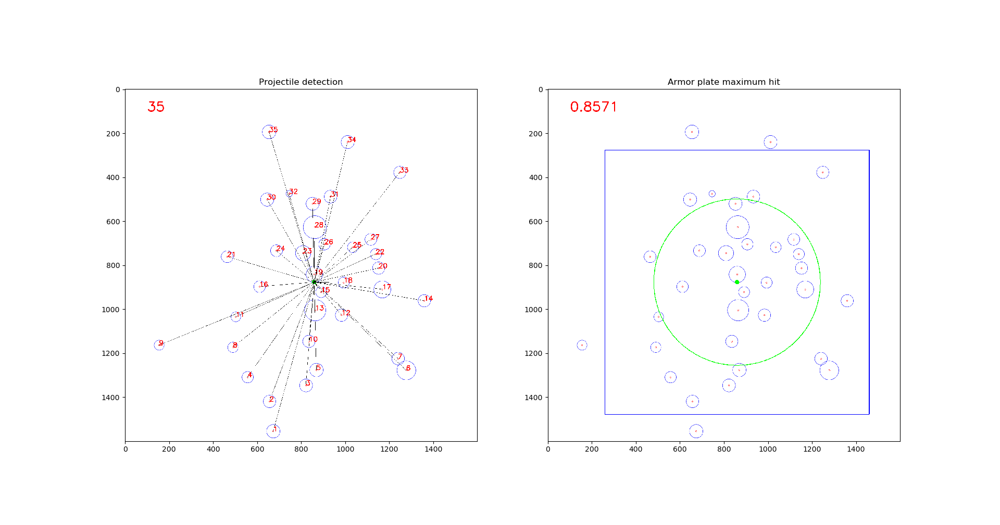
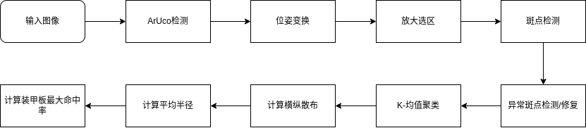
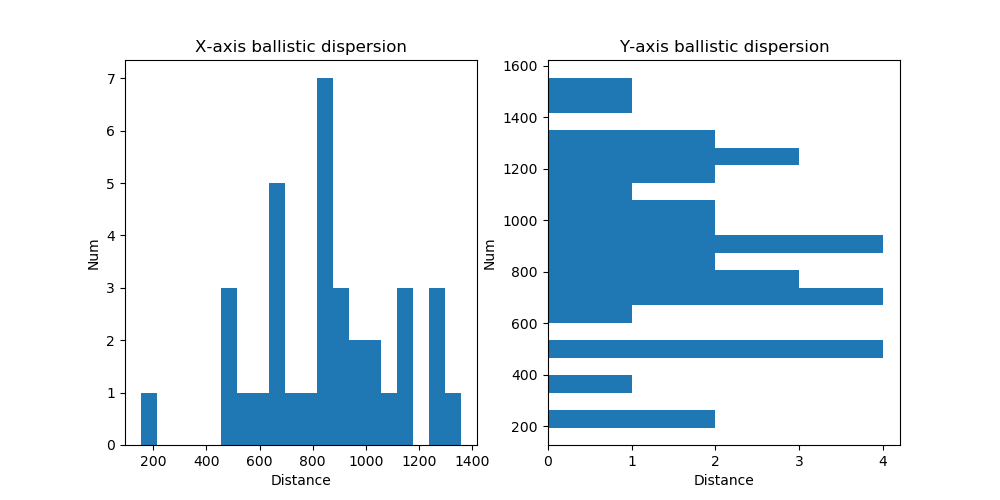

# 弹道量化测试工具
基于ArUco码的弹道量化测试工具




## 算法流程


## 依赖
python-opencv 4.10.0

matplotlib

sklearn

## 使用
修改传入图片，后续改为参数传入
```
frame=cv2.imread('artest/ar_test7.jpg')
```

根据实际情况修改相机内参矩阵（无严格要求，可默认）
```
camera_matrix = np.array([[1000, 0, 960], 
                          [0, 1000, 640], 
                          [0,    0,  1]], dtype=float)

dist_coeffs = np.zeros((5, 1))  
```

## 注意
相机拍照时应尽量保证散布中心点在相机中心且光线充足

## 后续改进

1.弹丸选区优化

2.斑点检测参数调优

3.可视化操作界面

